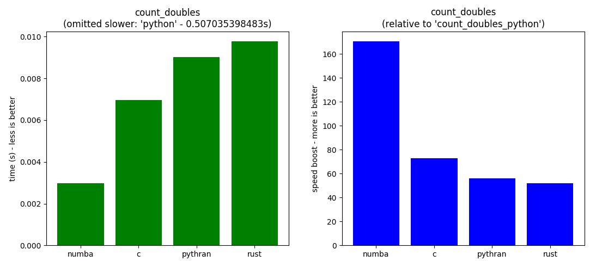
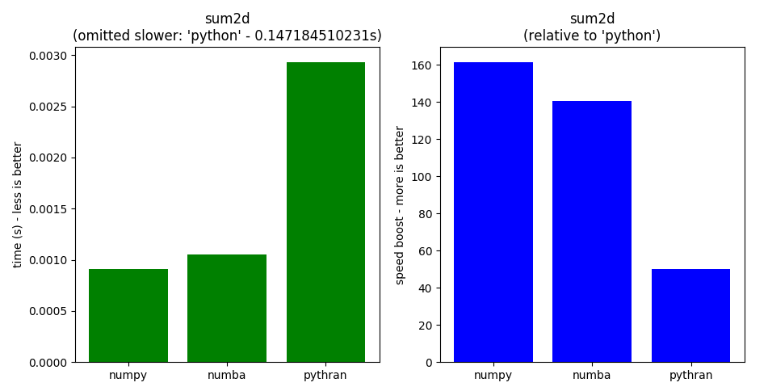

# tc-rusty

Tiago Coutinho's python adventures in the Rust world

# Benchmarks

### Hardware
DELL laptop Latitude E7440 (Intel i7 vPro 4 Core 3.3GHz; 8Gb RAM)

### Software

* Linux Mint 18 Sarah 64 bits
* Inside a conda environment: [conda packages](doc/conda_list.txt)
* CPython 2.7.14 |Anaconda, Inc.
* GCC 5.4.0
* LLVM 3.8.0
* Rust 1.21.0 stable

### Comparation

* Python - pure python implementation
* [Numba](http://http://numba.pydata.org)
* C with binding to python using [CFFI](http://cffi.rtfd.io)
* [Rust](http://www.rust-lang.org) with binding to python using [CFFI](http://cffi.rtfd.io)
* [Pythran](http://pythran.rtfd.io)

## Count doubles

*given a buffer of ASCII chars, count the number of times two adjacent
characters are equal*

## isum2d

**sum of all items in a numpy 2D array of int64**

